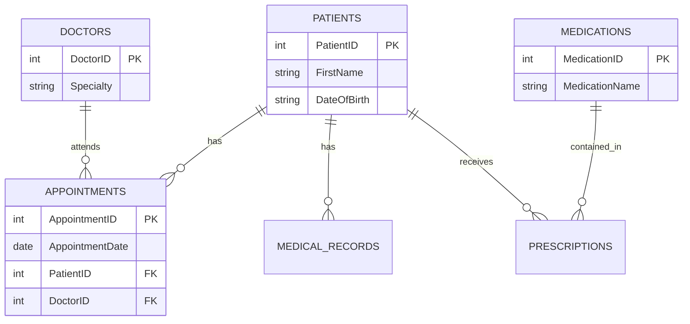

# Healthcare Data Management & Analytics using SQL

## Project Overview
This project focuses on designing and implementing a relational database system for a healthcare facility. The goal is to manage critical data entities—Patients, Doctors, Appointments, and Prescriptions—while ensuring data integrity and query efficiency.

Using **MySQL**, I designed a normalized schema and performed advanced SQL queries to derive operational insights, such as doctor workload distribution and medication demand trends.

## Entity-Relationship Diagram (ERD)
The database follows a relational structure connecting patients, doctors, and medical records. 

## Key Technical Skills
Database Design: Created a normalized schema with Primary and Foreign Key constraints to ensure referential integrity.

SQL Development: Wrote DDL (Data Definition Language) scripts to build the infrastructure.

Data Analysis: Utilized GROUP BY, JOIN, and Aggregate Functions (COUNT, AVG) to answer business questions.

Temporal Analysis: Used date functions to generate monthly patient growth reports.

## Key Insights & Queries
Workload Analysis: Calculated the average number of appointments per doctor to optimize staffing.

Inventory Management: Identified the top 3 most prescribed medications to aid in stock planning.

Patient Growth: Analyzed patient registration trends over the last 12 months.

## How to Run
Clone the repository.

Import setup_schema.sql into your MySQL Workbench or SQL environment to build the database.

Run analytical_queries.sql to execute the business analysis reports.
